<div id="top"></div>

<!-- PROJECT LOGO -->
<br />
<div align="center">
  

<h2 align="center">BALANCE Backend Coding Document</h2>
  <p align="center">
    <p style=""><strong>This document provides a comprehensive guide for coding balance project.</strong>
    </p>
  </p>
  
</div>

Vui lòng đọc tài liệu [Setup](https://github.com/Ari-balance/balance-be/blob/develop/document/training/BE/backend-setup.md) môi trường và [Coding rule](https://github.com/Ari-balance/balance-be/blob/develop/coding-rules.md) trước khi bắt đầu

<!-- TABLE OF CONTENTS -->
<details>
  <summary>Table of Contents</summary>
  <ol>
    <li>
      <a href="#tổng-quan-về-nestjs">Tổng quan về nestjs</a>
    </li>
    <li>
      <a href="#hướng-dẫn-tạo-resource-mới">Hướng dẫn tạo resource mới</a>
    </li>
    <li><a href="#hướng-dẫn-testing-api">Hướng dẫn testing api</a></li>
     <li><a href="#hướng-dẫn-testing-api">Ví dụ</a></li>
  </ol>
</details>


<br>

## Tổng quan về [nestjs](https://docs.nestjs.com)

NestJS là một NodeJS framework dùng để phát triển server-side applications hiệu quả và có thể mở rộng. NestJS là sự kết hợp bởi OOP(Object Oriented Programming), FP(Functional Programming), FRP(Functional Reactive Programming). NestJS sử dụng TypeScript để phát triển nhưng nó cũng hỗ trợ cả Javascript. 

Nestjs sử dụng một kiến trúc cụ thể bằng cách giới thiệu các module, provider và controller, đảm bảo ứng dụng highly scalable, testable và dễ dàng maintaince.

Các thành phần quan trọng trong NestJS:

### Module

Module có nhiệm vụ đóng gói những logic liên quan của các chức năng cần triển khai đến client một cách độc lập. Một module trong Nest là class được define với @Module (). @Module () sẽ cung cấp metadata mà Nest sử dụng để tổ chức cấu trúc ứng dụng.

<div style="display: block; width : 50%; margin:20px auto">

  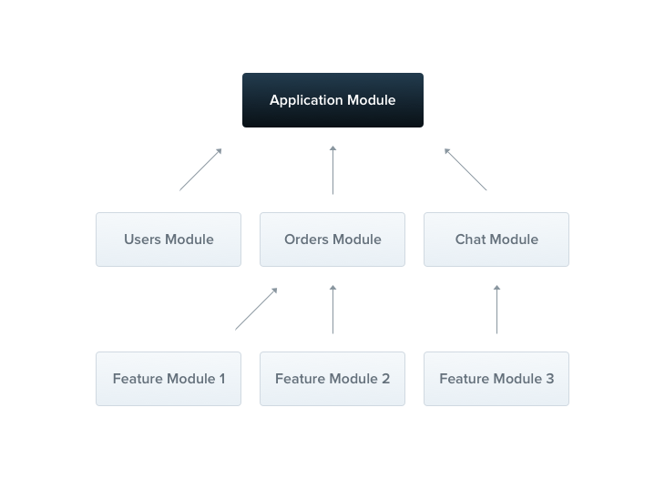

  </div>


Trong một module sẽ bao gồm các thành phần chính sau đây:

  - providers: Có nhiệm vụ khởi tạo và cung cấp các service mà sẽ được controller trong module sẽ sử dụng đến.

  - controllers: Có nhiệm vụ khởi tạo những controller đã được xác định trong module.

  - imports: Có nhiệm vụ import những thành phần của một module khác mà module sẽ sử dụng.

  - exports: Có nhiệm vụ export các thành phần của provider và các module khác sẻ import để sử dụng.

Nest hỗ trợ tạo ra các module bằng CLI. Để tạo ra một module users: 

  ```sh
  $ nest g module users
  ```

### Controller

Controller là nơi xử lý các request và trả về response cho người dùng. Mỗi controller sẽ chứa các router thực hiện hành động và nhiệm vụ khác nhau được yêu cầu từ client. Để tạo ra một controller chúng ta sử dụng một và @Controller(). @Controller() sẽ có nhiệm vụ liên kết class Controller đó với request tương ứng. Chúng ta sẽ tạo một controller cơ bản như sau, bạn cũng có thể tạo controller bằng cmd: 

  ```sh
  $ nest g controller users
  ```

  <div style="display: block; width : 50%; margin:20px auto">

  

  </div>

### Providers


  <div style="display: block; width : 50%; margin:20px auto">

  

  </div>

Provider là nơi cung cấp các serivce, repositories, factories, helpers,... cho controller trong một module sử dụng. Đây cũng là nơi sẽ chứa những logic xử lý đã được tách biệt với controller. Để tạo ra một provider chúng ta chỉ cần khai báo @Injectable () trước một class đã định nghĩa. Việc sử dụng @Injectable() sẽ cho Nest biết đây là một class thuộc provider. Để tạo ra một service nơi mà chứa các logic xử lý của UserController, chúng ta hãy tạo ra một UserService trong file user.service.ts dưới đây hoặc sử dụng cmd:

  ```sh
  $ nest g service auth
  ```

Tài liệu tham khảo:

[NestJs Document](https://docs.nestjs.com)

[Hướng dẫn cơ bản](https://viblo.asia/p/tim-hieu-ve-nestjs-phan-1-3P0lP0ymlox)

## Hướng dẫn tạo resource mới

Hướng dẫn chi tiết có thể tham khảo [link ](https://docs.nestjs.com/recipes/crud-generator#generating-a-new-resource).

Để tạo resource mới:
  - Vào thư mục src của server cần tạo
    ```sh
    $ cd suppermarket
    $ cd src
    ```
  - Generate resource với CMD:
    ```sh
    $ nest g resource
    ```
  - Trong resource tạo providers repository với tên resourceName.repository.ts và sau đó import vào module:

  <div style="display: block; width : 50%; margin:20px auto">

  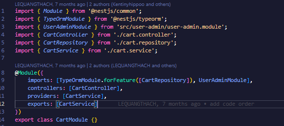

  </div>

  - Tạo 1 API mới:
    - Dựa vào yêu cầu chi tiêt của feature. Xem xét có cần phải xây dựng database hay không. Nếu cần phải được LEAD BACKEND đồng ý và review qua sql mới được chạy sql trên databse STAG.

    - Khai báo entity trong resource/entities/resource.ts. Ví dụ :

      Đối tượng "Category" bao gồm các thuộc tính:

       - "id": thuộc tính này được tạo tự động và là khóa chính của đối tượng "Category".
       - "name": tên của danh mục sản phẩm.
       - "code": mã của danh mục sản phẩm.
       - "parent_id": ID của danh mục cha của danh mục sản phẩm.
      
     
      ```sh
        import {
            Column,
            Entity,
            JoinColumn,
            ManyToOne,
            OneToMany,
            OneToOne,
            PrimaryGeneratedColumn,
        } from 'typeorm';

        # KHAI BÁO TÊN ENTITY và SCHEMA
        @Entity('organization_product_category.category')
        export class Category {
            # ĐỊNH DANH KHÓA CHÍNH
            @PrimaryGeneratedColumn()
            id: number;

            # THUỘC TÍNH CỦA ĐỐI THƯỢNG CATEGORY
            @Column()
            name: string;

            @Column()
            code: string;
            # TÊN CỦA THUỘC TÍNH ĐƯỢC ĐẶT THEO CAMELCASE
            @Column()
            parentId: number; 
            
            # ĐỊNH DANH KHÓA PHỤ LIÊN KÊT VỚI CÁC BẢNG
            @OneToOne(() => Category, (category) => category.parent)
            @JoinColumn({ name: 'parent_id', referencedColumnName: 'id' })
            parent: Category
        }

      ```
    - Trong thư mục cha tạo file resource.repository.ts:
      ```sh
      import {EntityRepository, Repository } from 'typeorm';
      import { Category } from './entities/category.entity';
      @EntityRepository(Category)
      export class CategoryRepository extends Repository<Category> {}
      ```

      Sau đó import repository vào module của resource:

      ```sh
      import { Module } from '@nestjs/common';
      import { TypeOrmModule } from '@nestjs/typeorm';
      import { CategoryController } from './category.controller';
      import { CategoryRepository } from './category.repository';
      import { CategoryService } from './category.service';

      @Module({
          imports: [
              TypeOrmModule.forFeature([CategoryRepository]),
          ],
          controllers: [CategoryController],
          providers: [CategoryService],
          exports: [CategoryService]
      })
      export class CategoryModule {}

      ```

    - Khai báo api: Tùy mục đích mà có thể khai báo api có phương thức, độ bảo mật và yêu cầu truyền dữ liệu khác nhau. Ví dụ:


      ```sh
      @Controller('category')
      @ApiTags('Category') # PHAN NHÓM API TRÊN SWAGGER
      export class CategoryController {
          constructor(
              private readonly connection: Connection,
              private categoryService: CategoryService # NHÚNG SERVICE ĐỂ XỬ LÝ LOGIC BÊN SERVICES
          ) {}

          # API LẤY CHI TIẾT DỮ LIỆU: NGOÀI RA CÒN DÙNG POST PUT DELETE
          @Get(':id')
          @UseGuards(RolesGuard) # ĐẢM BẢO NGƯỜI DÙNG CÓ ĐỦ QUYỀN ĐỂ LẤY DỮ LIỆU
          @ApiBearerAuth()
          #MÔ TẢ DỮ LIỆU API TRẢ VỀ
          @ApiResponse({
              status: 500,
              description: 'Lâý chi tiết danh mục bị lỗi.',
              type: null
          })
          @ApiResponse({
              status: 200,
              description: 'Lấy chi tiết danh mục thành công.',
              type: Category
          })
          #TÊN API TRÊN SWAGER
          @ApiOperation({ summary: 'Lấy chi tiết danh mục' })
          async getDetailCategory(
              @GetUser() user: UserAdmin,
              @Param('id') id: number
          ) {
              # API NÀY CẦN 2 THÔNG SỐ ĐẦU VÀO LÀ ID CỦA DANH MỤC VÀ NGƯỜI DÙNG.
              # VỀ PHẦN LOGIC SẼ ĐƯỢC XỬ LÝ BÊN SERVICE.
              return await this.categoryService.getDetailCategory(id, user);
          }
      }

      ```
    - Xử lý logic trong services: Trong file resource.services.ts

      ```sh
      import {Injectable } from '@nestjs/common';
      import { InjectRepository } from '@nestjs/typeorm';
      import { isNullOrUndefined } from '../common/func/ultil';
      import { UserAdmin } from '../user-admin/entities/user-admin.entity';
      import { CategoryRepository } from './category.repository';
      @Injectable()
      export class CategoryService {
          constructor(
              # IMPORT REPOSITORY ĐỂ XỬ LÝ NHỮNG PHẦN LIÊN QUAN ĐẾN DATABASE
              @InjectRepository(CategoryRepository)
              private categoryRepository: CategoryRepository,
          ) {}


          async getDetailCategory(id: number, user: UserAdmin) {
              try { # TRY CATCH ĐỂ HẠN CHẾ CHẾT SERVER 
                  # NHỮNG PHẦN LIÊN QUAN ĐẾN DATABASE SẼ ĐƯỢC XỬ LÝ BÊN REPOSITORY
                  const category = await this.categoryRepository.getDetailCategory(id, user);
                  if (isNullOrUndefined(category)) {
                      return {
                          statusCode: 500,
                          message: 'Lỗi khi lấy chi tiết danh mục sản phẩm',
                          data: null
                      };
                  }
                  # DỮ LIỆU TRẢ VỀ FE PHẢI ĐỦ 3 THÀNH PHẦN: statusCode, message, data.
                  return {
                      statusCode: 200,
                      message: 'Lấy chi tiết danh mục sản phẩm',
                      data: category
                  };
              } catch (error) {
                  return {
                      statusCode: 500,
                      message: 'Lỗi khi lấy chi tiết danh mục sản phẩm',
                      data: null
                  };
              }
          }
      }
      ```

    - Xử lý liên quan đến database: Những phần liên quan đến dữ liệu NÊN được xử lý trong file repository

      ```sh
      import { UserAdmin } from 'src/user-admin/entities/user-admin.entity';
      import { EntityRepository, Repository } from 'typeorm';
      import { Category } from './entities/category.entity';
      @EntityRepository(Category)
      export class CategoryRepository extends Repository<Category> {
          async getDetailCategory(id: number, user: UserAdmin) {

              # TẠO QUERY TRÊN BẢNG CATEGORY
              const category = await this.createQueryBuilder('category')
              # LINK TỚI 1 SỐ BẢNG LIÊN QUAN ĐỂ LẤY DỮ LIỆU
              .leftJoin('category.org', 'org')
              .leftJoin('category.subOrg', 'subOrg')
              .select(['category', 'org', 'subOrg'])
              # ĐIỀU KIỆN LẤY DỮ LIỆU
              .where('category.id = :id', { id })
              .andWhere('category.isDeleted = FALSE')
              .andWhere('category.orgId = :orgId', { orgId : user.orgId})
              .getOne();
              return category; # TRẢ DỮ LIỆU VỀ SERVICE
          }
      }

      ```

    MỘT SỐ LƯU Ý QUAN TRỌNG:
    - LUÔN LUÔN DÙNG  [TRANSACTION](https://orkhan.gitbook.io/typeorm/docs/transactions) TRONG NHỮNG API LIÊN QUAN ĐẾN UPDATE, DELETE, CREATE DỮ LIỆU
    - MỘT SỐ FUNCTION, SERVICE, REGEX DÙNG CHUNG SẼ ĐƯỢC ĐẶT TRONG FOLDER utils
    - HIỆN TẠI DỰ ÁN CÓ 2 SERVICE ĐỘC LẬP VỚI NHAU: 
      + cronjob: Liên quan đến 1 số tiến trình update theo thời gian (HIỆN TẠI CHỈ LIÊN QUAN ĐẾN KIOTVIET).
      + suppermarket: Liên quan đến nghiệp vụ chính.
      
      TÙY THEO FEATURE MÀ CÓ THỂ LIÊN QUAN ĐẾN 1 HOẶC CẢ 2 SERVICES.
## Hướng dẫn testing api.
  Để test api có thể dùng 1 trong 2 cách:
  - Sử dụng swagger:
    + Tiến hành chạy code và mở trình duyệt theo đường dẫn sau : http://localhost:3000/api/v1/supermarket.
    + Tìm api muốn test và thực hiện
    + ví dụ:

    <div style="display: block; width : 80%; margin:20px auto">

    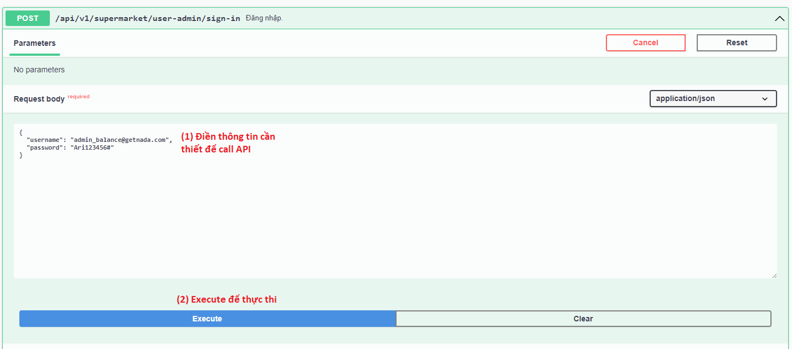

    </div>

  - Sủ dụng [Thunder Client](https://www.thunderclient.com) hoặc [postman](https://www.postman.com/downloads/)

    <div style="display: block; width : 80%; margin:20px auto">

    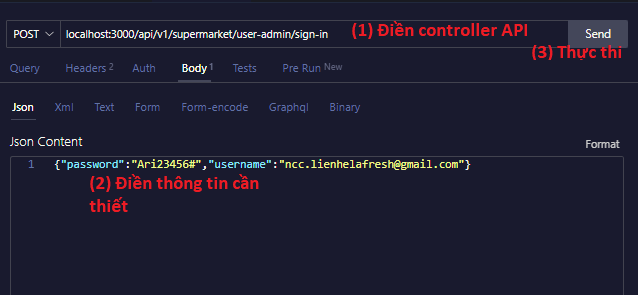

    </div>


## Ví dụ

# QUẢN LÝ CỬA HÀNG (BACKEND + FRONTEND)

I. BACK-END Side

Yêu cầu: Viết API lấy danh sách tất cả cửa hàng trong hệ thống (Admin view).

<div style="display: block; width : 80%; margin:20px auto">

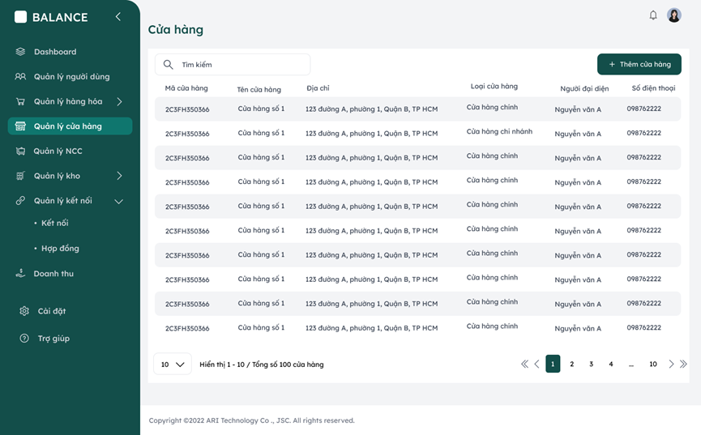

</div>

Phân tích yêu cầu:
  - Vì đây là API dành cho admin nên để đảm bảo bảo mật ta phải dùng AdminGuard
  - API lấy dạng danh sách nên phải có phân trang, search và filter.
  - Cần xác định dữ liệu trả vê có những thuộc tính nào và dựng dto dữ liệu trả về cho FE


Hiện Thực:

  - Dựng dto cho dữ liệu đầu vào và đầu ra cho API. Đối vói dữ liệu đầu vào có thể sử dụng lại những dto đã có sẵn trong file common/dto/get-list.dto.ts

    ```sh
    #DTO INPUT EXAMPLE
    import { IsNotEmpty, IsNumber, IsString } from 'class-validator';

    export class GetListDto {
        @IsNumber()
        @IsNotEmpty()
        page: number;

        @IsNumber()
        @IsNotEmpty()
        perPage: number;

        @IsString()
        filter?: string;

        @IsString()
        sort?: string;

        @IsString()
        fullTextSearch?: string;
    }

    #DTO OUTPUT EXAMPLE

    export class Store {
        id: number;

        code: string;

        name: string;

        address: string;

        type: string;

        address: string;

        peopleContact: {
          name : string;
          phone : string;
        };
    }

    ```
  - Viết controller:
  

    ```sh

    constructor(
        private subOrganizationService: SubOrganizationService
    ) {}

    @Get()
    # AdminGuard để đảm bảo người dùng có quyền lấy dữ liệu
    @UseGuards(AdminGuard)
    # Mô tả API cho SWAGGER
    @ApiBearerAuth()
    @ApiResponse({
        status: 500,
        description: 'Xem danh sách cửa hàng thất bại.'
    })
    @ApiResponse({
        status: 200,
        description: 'Xem danh sách cửa hàng thành công.'
    })
    @ApiOperation({ summary: 'Xem danh sách cửa hàng.' })
    async getSubOrganization(
        # LẤY THÔNG TIN ADMIN
        @GetUser() user: UserAdmin,
        # DTO DỮ LIỆU ĐẦU VÀO
        @Query() GetListDto: GetListDto,
    ) {
        # TRẢ VỀ DỮ LIỆU TỪ SERVICE
        return await this.subOrganizationService.getSubOrganization(
            GetListDto,
            user,
            type
        );
    }

    ```

  - Viết service:

    ```sh

    constructor(
        private subOrganizationRepository: SubOrganizationRepository,
    ) {}
    async getSubOrganization(
          getListDto: GetListDto,
          user: UserAdmin,
      ) {
          try {
              return await this.subOrganizationRepository.getSubOrganization(
                  user,
                  getListDto,
              );
          } catch (error) {
              Logger.error(error);
              throw new InternalServerErrorException(
                  'Lỗi khi lấy danh sách cửa hàng'
              );
          }
      }
    ```

  - Viết repository:

    ```sh
    async getSubOrganization(
        user: UserAdmin,
        getListDto: GetListDto,
    ) {
        const { perPage, page, filter, fullTextSearch } = getListDto;
        #GIỚI HẠN DỮ LIỆU RẢ VỀ
        const limit = Math.min(perPage, CONSTANT.LIMIT);
            const subOrganization = await getRepository(SubOrganization)
                .createQueryBuilder('sub_organization')
                # JOIN NHỮNG BẢNG CẦN THIẾT ĐỂ LẤY DỮ LIỆU
                .leftJoin('sub_organization.address', 'address')
                .leftJoin('address.ward', 'ward')
                .leftJoin('address.district', 'district')
                .leftJoin('address.province', 'province')
                .leftJoin('sub_organization.userRole', 'userRole')
                .leftJoin('userRole.userAdmin', 'userAdmin')
                .select([
                    # CHỈ LẤY NHỮNG THUỘC TÍNH CẦN THIẾT
                    'sub_organization.id',
                    'sub_organization.code',
                    'sub_organization.name',
                    'address',
                    'ward',
                    'district',
                    'province',
                    'userRole.roleId',
                    'userAdmin.id',
                    'userAdmin.name',
                    'userAdmin.phoneNumber',
                    'userAdmin.email',
                    'sub_organization.isActive',
                    'sub_organization.note',
                    'sub_organization.code',
                    'sub_organization.createdOn',
                    'sub_organization.updatedAt',
                    'sub_organization.storeId'
                ])
                # FILTER ĐIỂU KIỆN DỮ LIỆU TRẢ VỀ
                .where(`sub_organization.orgId = ${user.orgId}`)
                .andWhere('sub_organization.type = :type', { type : SubOrgType.STORE })
                # LẤY DỮ LIỆU CHO PHÂN TRANG
                .take(limit)
                .skip((page - 1) * limit)
                .orderBy('sub_organization.updatedAt', 'DESC');

                  const data = await subOrganization.getMany();
                  const total = await subOrganization.getCount();
                  
                  const returnData : Store[] = [];
                  data.forEach(element=>{
                    const store = new Store();
                    store.id = element.id;
                    store.code = element.code;
                    .....
                    returnData.push(store);
                  })
                # DỮ LIỆU TRẢ VỀ THEO DẠNG PAGE
                return {
                    statusCode: 200,
                    message: `Lấy danh sách cửa hàng thành công`,
                    data: returnData,
                    pagination: { total: total, limit: perPage, offset: page }
                };
    }
    ```
  - Kiểm thử API trên POSTMAN hoặc THUNDER CLIENT hoặc SWAGGER.

    <div style="display: block; width : 80%; margin:20px auto">

    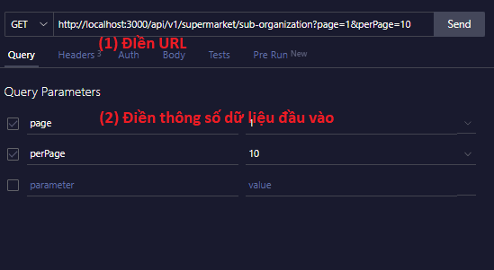

    </div>


    <div style="display: block; width : 80%; margin:20px auto">

    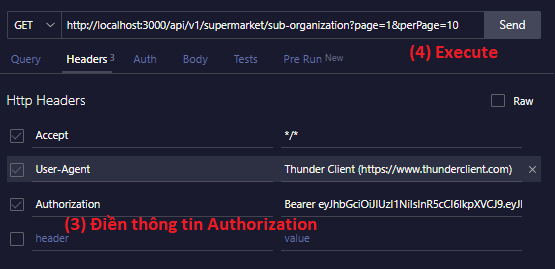

    </div>


Thach Le Quang - [GitHub](https://github.com/LEQUANGTHACHBK) - lequangthachbk@gmail.com

----------------------------

II. FRONT-END Side

Yêu cầu: Thiết kế giao diện lấy danh sách tất cả cửa hàng trong hệ thống (Admin view).

### *Lưu ý : Dưới đây là một ví dụ mẫu, có thể linh động để code clean hơn.

<div style="display: block; width : 80%; margin:20px auto">


</div>

- Bước 1 : Tạo menu "Quản lý cửa hàng" và icon "Store" ở navbar bên trái trong src/layouts/admin/menus.js

<div style="display: block; width : 60%; margin:20px auto">

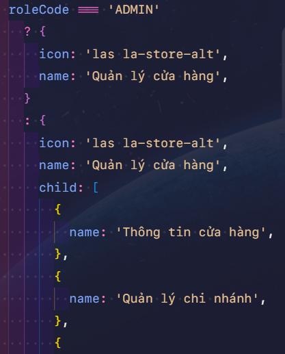

</div>

- Bước 2 : Định nghĩa routes trong file router-link tại đường dẫn: src/utils/router-links.js

<div style="display: block; width : 60%; margin:20px auto">


</div>

- Bước 3 : Tạo thư mục và file index tương ứng để hoàn thiện code UI và logic trong folder routes > admin 

<div style="display: block; width : 100%; margin:20px auto">

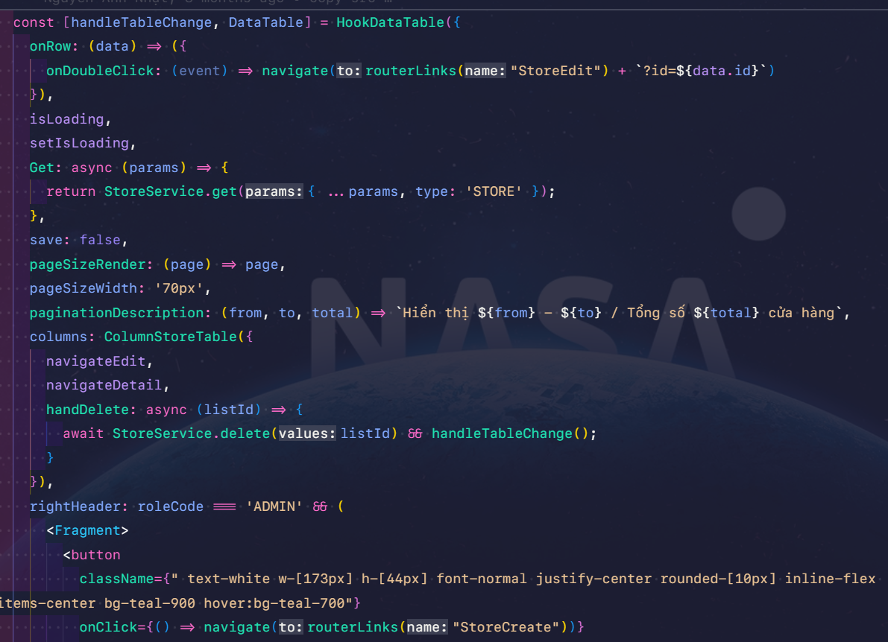

</div>

... và đừng quên render table vừa tạo

<div style="display: block; width : 100%; margin:20px auto">

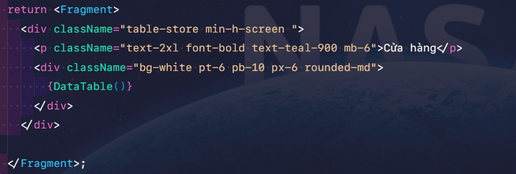

</div>

- Bước 4 : Trong lúc tạo đến phần định nghĩa column cho table, hãy chú ý định nghĩa column trong thư mục src/columns

_ Chính là phần định nghĩa column trong hook table ở đây:
<div style="display: block; width : 100%; margin:20px auto">

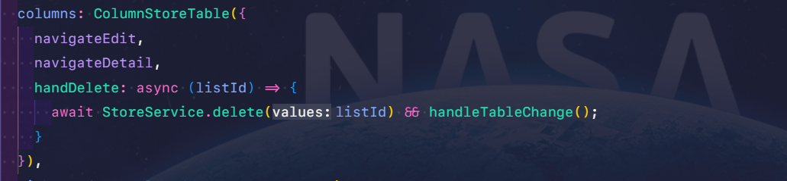

</div>

_ Trong thư mục src/columns, tạo folder và đặt tên file tương ứng chẳng hạn src/columns/store, đồng thời tạo file index làm nhiệm vụ import export.

<div style="display: block; width : 60%; margin:20px auto">

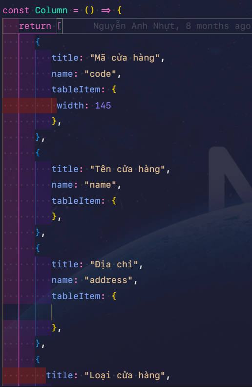

</div>

Khai báo và export column vừa tạo trong file index :

 ```sh
    import ColumnStoreTable from './table';


    export {
      ColumnStoreTable
    }
  ```

- Bước 5 : Định nghĩa call API cho table trong thư mục services (ở đây là API get danh sách các stores). Đường dẫn: src/services

<div style="display: block; width : 100%; margin:20px auto">

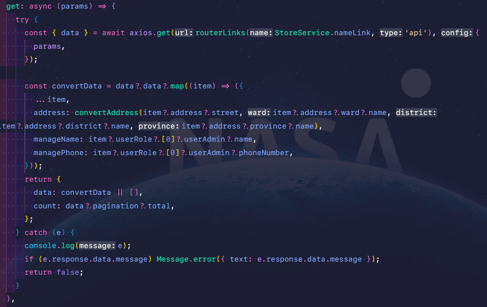

</div>

- Bước 6 : Khai báo đường dẫn thư mục/file code trong đường dẫn: src/routes/pages.js

<div style="display: block; width : 100%; margin:20px auto">

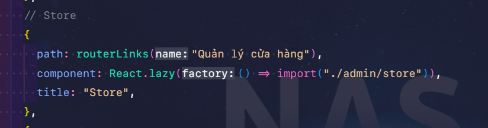

</div>

- Bước 7 : Hoàn thiện UI theo figma, nếu phát sinh các tác vụ code khác hay page khác, tạo file mới trong folder store và code. 

*** Lưu ý cần chia nhỏ component để dễ dàng maintain, test và fix bugs (nếu có)...

------------------------------
