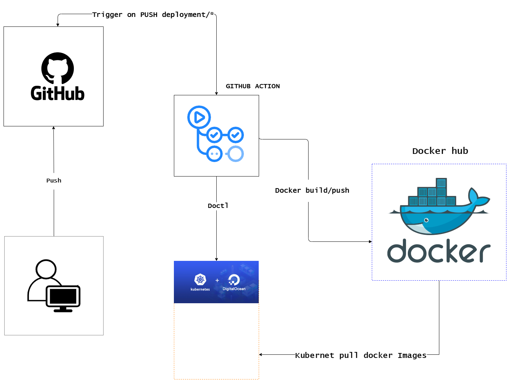

<div id="top"></div>

<!-- PROJECT LOGO -->
<br />
<div align="center">
  

<h2 align="center">BALANCE Backend Deployment Document</h2>
  <p align="center">
    <p style=""><strong>This document provides a comprehensive guide for deploying your project.</strong>
    </p>
  </p>
</div>

For AWS can follow [Link](https://www.youtube.com/watch?v=kG1kO3vAxNc&list=PLtiTnp7fWhWvWKxOmrSRVDX2qyswVh0eH&index=3) hoặc  [Link](https://drive.google.com/drive/u/0/folders/19TFnvc_Fm-5Q5S-7ZLJ828KuVRP_5nwA)


<!-- TABLE OF CONTENTS -->
<details>
  <summary>Table of Contents</summary>
  <ol>
    <li>
      <a href="#overview">Overview</a>
    </li>
    <li>
      <a href="#setup">Setup</a>
    </li>
    <li><a href="#secrets">Secrets</a></li>
    <li><a href="#contact">Contact</a></li>
    <li><a href="#acknowledgments">Acknowledgments</a></li>
  </ol>
</details>


<br>

## Overview

After the code has been tested and pushed to the deployment branch for the environment, The steps is:

<div style="display: block; width : 50%; margin:20px auto">



</div>

 * Verify that the deployment environment is set up github action and trigger on push code for this deployment branch and specifi folder code has been change.

 * With github action, pull the latest code from the deployment branch, build the Docker image of your service and push it to a Docker registry.

* Deploy the Docker image to Kubernetes cluster, using Doctl.

* Verify that the deployment was successful by checking the logs, accessing the user interfaces, and testing the functionality of the deployed application.

By following the steps outlined in the Deployment Document, you can ensure that your code is deployed successfully and efficiently.

   


## Setup


### 1. Create K8s Cluster
Using DigitalOcean Kubernets cluster for easy-to-use, cost-effective, reliable, and customizable solution for deploying and managing.

To create a cluster on DigitalOcean:

- Create a DigitalOcean account (using paypal or visa).

- Log in to the DigitalOcean control panel.

- Using promotion code for free 200$.

- Click the "Create" button and select "Kubernetes" from the list of options.

- Configure any options and create cluster.

- Wait for the cluster to be created, which can take several minutes.

- Once the cluster is created, you can access it using the provided credentials.

- Install and configure the kubectl command-line tool to manage your cluster from your local machine.


### 2. Manage K8s Cluster
Prerequisites : a Kubernetes cluster, doctl, Helm, Docker and Kubernetes on local machine.

* Access to cluster:

  - Get token from API tab on Digital Ocean 
  - Run command:
  ```sh
    doctl auth init --access-token=TOKEN

    doctl kubernetes cluster kubeconfig save CLUSTER_NAME

  ```

* Installing the Kubernetes Nginx Ingress Controller for access to applications from the outside:

  - Run command:
  ```sh
    helm repo add ingress-nginx https://kubernetes.github.io/ingress-nginx

    helm repo update

    helm install nginx-ingress ingress-nginx/ingress-nginx --set controller.publishService.enabled=true

  ```

  - Run this command to watch the Load Balancer become available:
  ```sh
    kubectl --namespace default get services -o wide -w nginx-ingress-ingress-nginx-controller
  ```

* Securing the Ingress Using Cert-Manager

    To secure Ingress Resources, install Cert-Manager, create a ClusterIssuer for production, and modify the configuration of Ingress to use the TLS certificates. Once installed and configured, app will be running behind HTTPS.

    - Create a namespace for Cert-Manager:
    ```sh
      kubectl create namespace cert-manager
    ```

    - Run command:
  ```sh
    helm repo add jetstack https://charts.jetstack.io

    helm repo update

    helm install cert-manager jetstack/cert-manager --namespace cert-manager --version v1.8.1 --set installCRDs=true

  ```

  - Create production_issuer.yaml file:
  ```sh
    apiVersion: cert-manager.io/v1
    kind: ClusterIssuer
    metadata:
      name: letsencrypt-prod
    spec:
      acme:
        # Email address used for ACME registration
        email: your_email_address
        server: https://acme-v02.api.letsencrypt.org/directory
        privateKeySecretRef:
          # Name of a secret used to store the ACME account private key
          name: letsencrypt-prod-private-key
        # Add a single challenge solver, HTTP01 using nginx
        solvers:
        - http01:
            ingress:
              class: nginx

  ```
  - And Roll it out with kubectl:
  ```sh
    kubectl apply -f production_issuer.yaml
  ```

### 3. Configure File
- Github action: There are two types of configuration files: 

  - Service files: Each service in application have its own github action configuration file, which defines the conditions under which the service should be deploy only for this services.

    Example: Configure file for supermarket service 
    ```sh
      # Name of workflow
      name: UAT_DEPLOY_SUPERMARKET
      # Triggered when a push is made to the deployment/uat branch and only if the pushed changes are  made to the supermarket/ directory.
      on:
        push:
          branches: [ deployment/uat]
          paths:
            - 'supermarket/**'

      # A single job named build that runs on the latest version of Ubuntu.
      jobs:
        build:
          runs-on: ubuntu-latest
          steps:
            # Checkout the code from the repository using the actions/checkout@v3 action
            - uses: actions/checkout@v3
            # Login to Docker hub using the environment variables DOCKER_USERNAME and DOCKER_PASSWORD, which are encrypted as Github secrets.
            - run: docker login -u $DOCKER_USERNAME -p $DOCKER_PASSWORD
              env:
                DOCKER_USERNAME: ${{ secrets.DOCKER_USERNAME }}
                DOCKER_PASSWORD: ${{ secrets.DOCKER_PASSWORD }}
            # Build a Docker image of the supermarket code using the build argument DOCKER_ENV=uat and tag it as egsc/supermarket:uat.
            - run: cd supermarket && docker build --build-arg DOCKER_ENV=uat --no-cache -t egsc/supermarket:uat .
            # Push the newly built Docker image to Docker Hub.
            - run: docker push egsc/supermarket:uat
            # Use the digitalocean/action-doctl@v2 action to authenticate to DigitalOcean with the encrypted token secrets.DIGITALOCEAN_ACCESS_TOKEN_UAT
            - uses: digitalocean/action-doctl@v2
              with:
                token: ${{ secrets.DIGITALOCEAN_ACCESS_TOKEN_UAT }}
            # Save the kubeconfig for the UAT cluster in DigitalOcean and name it uat-balance.
            - run: doctl kubernetes cluster kubeconfig save uat-balance
            # Roll out a restart of the supermarket-depl deployment in the UAT cluster.
            - run: kubectl rollout restart deployment supermarket-depl
    ```
  * Manifest file: Ensuring infrastructure changes in the system.

    Example: Configure file for manifests 
    ```sh
      # Name of workflow
      name: UAT_DEPLOY_MANIFESTS
      # Trigger whenever a push is made to the deployment/uat branch or if changes are made to any files within the infra/k8s-uat directory.
      on:
        push:
          branches: [ deployment/uat]
          paths:
            - 'infra/k8s-uat/**'
      # A single job named build that runs on the latest version of Ubuntu.
      jobs:
        build:
          runs-on: ubuntu-latest
          steps:
            # Check out the repository using the actions/checkout@v3 action.
            - uses: actions/checkout@v3
            # Use the digitalocean/action-doctl@v2 action to authenticate with the DigitalOcean API using the UAT environment's access token stored in a GitHub Actions secret.
            - uses: digitalocean/action-doctl@v2
              with:
                token: ${{ secrets.DIGITALOCEAN_ACCESS_TOKEN_UAT }}
            # Save the kubeconfig for the UAT cluster in DigitalOcean and name it uat-balance.
            - run: doctl kubernetes cluster kubeconfig save uat-balance
            # Apply the changes defined in the Kubernetes manifests located in the infra/k8s-uat directory.
            - run: kubectl apply -f infra/k8s-uat
    ```

* Deployment files:

  * Ingress configfile: The Ingress resource allows inbound requests to be redirected to different services within the cluster. The Ingress uses the Nginx Ingress Controller and is configured to use the 'nginx' class. 


    Example: 
    ```sh
    apiVersion: networking.k8s.io/v1
    kind: Ingress
    metadata:
      name: ingress-service
      annotations:
        kubernetes.io/ingress.class: nginx
        nginx.ingress.kubernetes.io/use-regex: "true"
        nginx.ingress.kubernetes.io/proxy-body-size: "600m"
        nginx.org/client-max-body-size: "600m"
        cert-manager.io/cluster-issuer: letsencrypt-prod
    spec:
      tls:
        - hosts:
          - api.stag.balance.uhouseproduct.com
          secretName: balance-tls
      rules:
        - host: api.stag.balance.uhouseproduct.com
          http:
            paths:
              - path: /api/v1/supermarket/?(.*)
                pathType: Prefix
                backend:
                  service:
                    name: supermarket-srv
                    port:
                      number: 3000
              - path: /api/v1/cronjob/?(.*)
                pathType: Prefix
                backend:
                  service:
                    name: cronjob-srv
                    port:
                      number: 3000
    ```

    The Ingress has 2 different host names which will use Transport Layer Security (TLS) and will have a certificate provided by the 'letsencrypt-prod' issuer. The three rules specify the mapping of host names and paths to the different backend services running within the cluster. For example, requests made to /api/v1/supermarket/ will be redirected to the supermarket-srv service on port 3000.

  * Deployment file:  Defines two resources in a Kubernetes cluster: a Deployment and a Service.
    
    Example: 

    ```sh
    apiVersion: apps/v1
    kind: Deployment
    metadata:
      name: supermarket-depl
    spec:
      replicas: 2
      selector:
        matchLabels:
          app: supermarket
      template:
        metadata:
          labels:
            app: supermarket
        spec:
          containers:
            - name: supermarket
              image: egsc/supermarket:stag
              env:
                - name: DB_PASS
                  valueFrom:
                    secretKeyRef:
                      name: db-key
                      key: DB_PASS
              imagePullPolicy: Always
              
    ---
    apiVersion: v1
    kind: Service
    metadata:
      name: supermarket-srv
    spec:
      selector:
        app: supermarket
      ports:
        - name: supermarket
          protocol: TCP
          port: 3000
          targetPort: 3000
    ```

    The Deployment resource named "supermarket-depl" creates two replicas of a container running the image "egsc/supermarket:stag". The image is pulled from a Docker registry, and the environment variable "DB_PASS" is set using a secret stored in the cluster.

    The Service resource named "supermarket-srv" exposes the replicas created by the Deployment. It listens on port 3000 and forwards incoming traffic to the same port on the containers. The selector field defines how the Service identifies the pods to target, in this case pods with a label of "app: supermarket".


## Secrets

### 1. Github action secrets

  - GitHub Actions secrets can be declared in the GitHub repository's settings page. 
  - To declare a secret, follow these steps:
    - Go to the GitHub repository in question
    - Click on the "Settings" tab
    - Click on "Secrets" on the left-side menu
    - Click on the "New repository secret" button
    - Enter a name for the secret (e.g. DOCKER_USERNAME)
    - Enter the value of the secret
    - Click on the "Add secret" button
    - After declaring a secret, you can use it in your GitHub Actions workflow file by referencing ${{ secrets.SECRET_NAME }}.
  - BALANCE project currently using 3 secret : DOCKER_NAME, DOCKER_PASSWORD, DIGITALOCEAN_ACCESS_TOKEN;


### 2. K8s secrets 
  
  - To declare a secret in K8s cluster:
    - Access to cluster and run the following:
    ```sh
      kubectl create secret generic db-key --from-literal=DB_PASS=PASS
    ```
    - Or setup on K8s Dashboard:

  - BALANCE project currently using 1 k8s cluster secret : DB_PASS;
<!-- CONTACT -->
## Contact

Thach Le Quang - [GitHub](https://github.com/LEQUANGTHACHBK) - lequangthachbk@gmail.com

<!-- ACKNOWLEDGMENTS -->
## Acknowledgments

