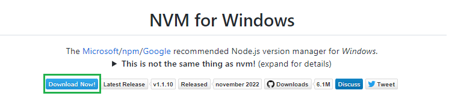
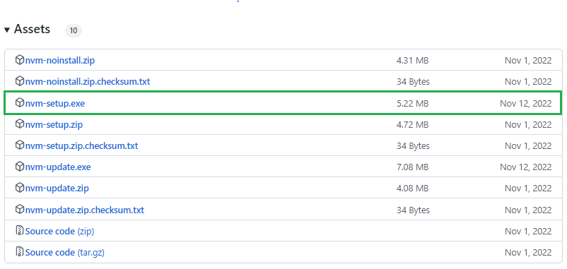
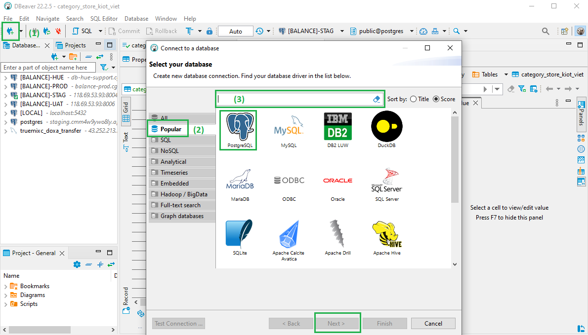
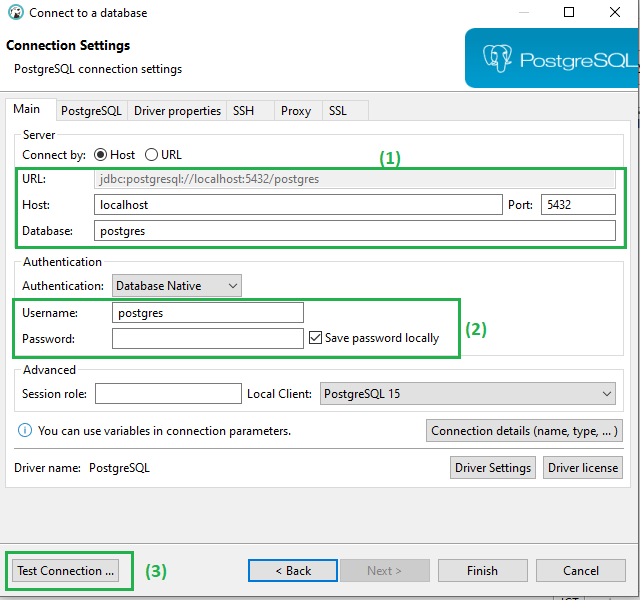

<div id="top"></div>

<!-- PROJECT LOGO -->
<br />
<div align="center">
  

<h2 align="center">BALANCE Backend Document</h2>
  <p align="center">
    <p style=""><strong>This document provides a comprehensive guide for setup balance project.</strong>
    </p>
  </p>
</div>


<!-- TABLE OF CONTENTS -->
<details>
  <summary>Table of Contents</summary>
  <ol>
    <li>
      <a href="#hướng-dẫn-cài-đặt-nodejs ">Hướng dẫn cài đặt Nodejs</a>
    </li>
    <li>
      <a href="#cài-đặt-phần-mềm-cơ-sở-dữ-liệu">Cài đặt phần mềm cơ sở dữ liệu</a>
    </li>
    <li><a href="#cài-đặt-phần-mềm-soạn-thảo">Cài đặt phần mềm soạn thảo</a></li>
    <li><a href="#cài-đặt-phần-mềm-quản-lý-mã-nguồn">Cài đặt phần mềm quản lý mã nguồn</a></li>
    <li><a href="#chạy-thử-phần-mềm">Chạy thử phần mềm</a></li>
  </ol>
</details>


<br>

## Hướng dẫn cài đặt Nodejs 

### Cài đặt  Node Version Manager - NVM

1. Windows: 
  - Truy cập [GitHub](https://github.com/coreybutler/nvm-windows#readme), click download now

  <div style="display: block; width : 50%; margin:20px auto">

  

  </div>

  - Cài đăt file .exe của bản cập nhật mới nhất:

  <div style="display: block; width : 50%; margin:20px auto">

  

  </div>

  - Kiểm tra sau khi cài đặt:

      ```sh
        nvm -v
      ```
2. Linux hoặc Mac
  - Trên terminal chạy lệnh sau:

    ```sh
      curl -o- https://raw.githubusercontent.com/nvm-sh/nvm/v0.39.1/install.sh | bash
      # or
      wget -qO- https://raw.githubusercontent.com/nvm-sh/nvm/v0.39.1/install.sh | bash
      ```

  - Cập nhật profile configuration:

    ```sh
      export NVM_DIR="$([ -z "${XDG_CONFIG_HOME-}" ] && printf %s "${HOME}/.nvm" || printf %s "${XDG_CONFIG_HOME}/nvm")"
      [ -s "$NVM_DIR/nvm.sh" ] && \. "$NVM_DIR/nvm.sh"
    ```
  - Reload shell configuration:

    ```sh
      source ~/.bashrc
      nvm -v
    ```
3. Mac Silicon: Tham khảo [link](https://trungquandev.com/cai-dat-nvm-nodejs-va-git-tren-macos-m1-silicon/)
  

### Cài đặt Nodejs

```sh
  # Xem tất cả phiên bản node có trong máy hiện tại
  nvm ls 

  # Cài đặt node version 16.16.0
  nvm install 16.16.0 64

  # Sử dụng node version 16.16.0
  nvm use 16.16.0

  #Kiểm tra phiên bản node
```


## Cài đặt phần mềm cơ sở dữ liệu 

### Cài đặt phần mềm
  - Tải file cài đặt theo hệ điều hành theo [link](https://dbeaver.io/download/) sau:
  - Tiền hành cài đăt phần mềm. Có thể tham khảo [link](https://blogchiasekienthuc.com/phan-mem-mien-phi/dbeaver.html)

### Kết nối với cơ sở dữ liệu
1. Đối với mỗi môi trường STAG, UAT sẽ có 1 database riêng. Thông tin kết nối với database sẽ được lưu trong thư mục env.
2. Để tiến hành kết nối ta thực hiện:

   - (1) Click vào đây để thực hiện kết nối đến cơ sở dữ liệu.

    - (2) Chọn Popular nếu các bạn muốn hiển thị các hệ quản trị cơ sở dữ liệu mà  phổ biến trên Dbeaver.

    - (3) Các bạn có thể gõ tên để tìm cho nhanh.


<div style="display: block; width : 80%; margin:20px auto">

  

</div>

  Sau khi chọn Postgress và bấm Next ở bước trước thì sẽ có một hộp thoại được hiển thị lên như sau.
 
<div style="display: block; width : 80%; margin:20px auto">

  

</div>
    
  - (1) Bao gồm các thông tin về server (Server Host: địa chỉ máy chủ, Port: cổng, Database: database các bạn định kết nối)
  - (2) Authentication: Các thông tin về username và password để truy cập vào hệ quản trị cơ sở dữ liệu.
  - (3) Bấm Test Connection…
  - Ngoài ra nếu có pop up Các bạn bấm vào nút Download để tải Postgress Driver (nếu chưa tải trước đó).


## Cài đặt phần mềm soạn thảo

### Hệ điều hành Windows

- Tải file cài đặt Visual Studio Code cho Windows.
- Sau khi tải xong, chạy file VSCodeUserSetup.exe.
- Nhấp vào Next để cài đặt. Tiếp theo đồng ý điều khoản sử dụng.
- Lựa chọn nơi cài đặt (Nên để mặc định) sau đó nhấn Next.
- Các bước tiếp theo tiếp tục nhấn Next cho tới khi hoàn tất. Trong quá trình này, nên tích chọn vào 2 chức năng: (1) Add “Open with Code” action to Windows Explorer file context menu và (2) Add “Open with Code” action to Windows Explorer directory context menu. Việc này giúp bạn có thể click chuột phải vào thư mục sẽ có lựa chọn mở bằng VS Code.

### Hệ điều hành MacOS

- Tải file cài đặt Visual Studio Code cho MacOS là 1 file nén zip.
- Sau khi tải xong, tiến hành giải nén bằng cách double click. Khi đó, hãy kéo Visual Studio Code.app vào thư mục Applications.
## Cài đặt phần mềm quản lý mã nguồn
Vào trang web tải [GIT](https://git-scm.com/downloads)  chọn mục Downloads > Chọn Tải xuống Git phiên bản Windows > Mở file Git chọn Run > Chọn Next > Chọn Browse, chọn nơi cài đặt ấn Next > Chọn Next > Chọn vị trí lưu trên Start Menu, lần lượt chọn Next > Chọn Install > Nhấn Finish.
## Chạy thử phần mềm

- Clone mã nguồn từ GITHUB thông qua git
- Mở mã nguồn bằng Visual Studio Code
- Run:
  
    ```sh
      cd suppermarket
      npm i
      npm run start:dev
    ```


Thach Le Quang - [GitHub](https://github.com/LEQUANGTHACHBK) - lequangthachbk@gmail.com

