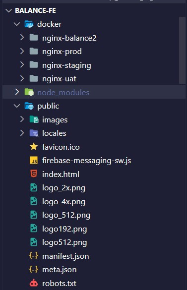
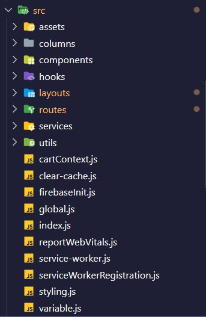

<!-- PROJECT LOGO -->
 

  

<h2 align="center">BALANCE FrontEnd Coding Document</h2>
  

    
<strong>This document provides a comprehensive guide for coding balance project.</strong>
    

  

Vui lòng đọc tài liệu [Setup FE Balance](https://github.com/Ari-balance/balance-be/blob/develop/document/training/FE/frontend-setup.md) trước khi bắt đầu.

 

<!-- TABLE OF CONTENTS -->

  
Phụ Lục

  <ol>
    <li>
      <a href="#tổng-quan-về-reactjs">Tổng quan về ReactJS</a> 
    </li>
    <li>
      <a href="#tổng-quan-cấu-trúc-code-dự-án">Cấu trúc code FrontEnd dự án BALANCE</a>
    </li>
      <li>
      <a href="#tổng-quan-thư-mục-code-dự-án">Các thư mục quan trọng của source code Front End</a>
    </li>
     <li>
      <a href="#tổng-quan-quản-lý-nhánh-code-dự-án">Các nhánh code quan trọng</a>
    </li>
    <li>
      <a>Tạo một màn hình mẫu (Quản lý cửa hàng):</a>
      Đường dẫn (Hướng dẫn FrontEnd code được ghép chung với BackEnd, bạn hãy kéo xuống phần dưới cùng để xem) :  
      <a href="https://github.com/Ari-balance/balance-be/blob/develop/document/training/BE/backend-coding.md">Balance FrontEnd Create new screen</a>
    </li>
  </ol>

 

## Tổng quan về ReactJS

[ReactJS](https://reactjs.org) là một thư viện Javascript đang nổi lên trong những năm gần đây với xu hướng Single Page Application. 
Trong khi những framework khác cố gắng hướng đến một mô hình MVC hoàn thiện thì React nổi bật với sự đơn giản và dễ dàng phối hợp với những thư viện Javascript khác. 
Nếu như AngularJS là một Framework cho phép nhúng code javasscript trong code html thông qua các attribute như ng-model, ng-repeat...thì với react là một library cho phép nhúng code html trong code javascript nhờ vào JSX, bạn có thể dễ dàng lồng các đoạn HTML vào trong JS.
Việc tích hợp giữa javascript và HTML vào trong JSX làm cho các component dễ hiểu hơn.

Một trong những điểm hấp dẫn của React là thư viện này không chỉ hoạt động trên phía client, mà còn được render trên server và có thể kết nối với nhau. 
React so sánh sự thay đổi giữa các giá trị của lần render này với lần render trước và cập nhật ít thay đổi nhất trên DOM.

Tìm hiểu thêm về Virtual DOM, JSX, Components, Props và State để hiểu sâu hơn về REACT JS…

Link tham khảo : https://viblo.asia/p/gioi-thieu-ve-reactjs-phan-i-cac-khai-niem-co-ban-V3m5WzjblO7

Link trang chủ reactJS : https://reactjs.org/

> Bên cạnh đó, tham khảo học cách sử dụng thư viện TAILWINDCSS và ANT DESIGN (hai trong số các thư viện chính được sử dụng trong Project Balance).
Link trang chủ: https://tailwindcss.com  và   https://ant.design

  

  

---------------

## Tổng quan cấu trúc Code dự án

 

- WORK FLOW (tham khảo)
1. Đọc hiểu requirement  
2. Xem design Figma/Wireframe
3.  Phân tích UI, chia component 
4. Hoàn thiện UI 
5. Giao tiếp với BackEnd để gắn API/giải quyết các vấn đề liên quan 
6. Giao tiếp với tester/Fix bugs

- CODE FLOW (tham khảo)
1. Pull source mới để có đầy đủ code nhất 
2. Tạo file index chính cho layout 
3. Tạo router trong file router-link, tạo menu trong file menu và pages, định nghĩa tên đa ngôn ngữ trong file translation.json (en/vi) 
4. Hoàn thiện code UI và logic 
5. Tạo các tác vụ call API trong folder Services 
6. Hoàn thiện mapping API

*Lưu ý hãy sử dụng các hooks/components có sẵn để tạo UI components như table, form, message… Đối với table và form, định nghĩa các column/input form trong folder columns.

>>>>.

## Tổng quan thư mục Code dự án

1. docker : chứa các folder server/deploy, file config/key/certification
2. public: chứa các folder hình ảnh public, ngôn ngữ

  

  

3. Src (Thư mục code chính): 

a) assets : chứa tài nguyên chung của web như font, images, styles, svg

b) columns: định nghĩa các phần tử cột, các dạng input… của table, form.

c) components: chứa các component tái sử dụng của project

d) hooks: chứa các hooks tái sử dụng của project

e) layouts: chứa header footer và định nghĩa các menu navbar của website.

f) routes: chứa tất cả các file code UI hoàn chỉnh theo từng màn hình của project.

g) services: chứa các file định nghĩa API

h) ultis: chứa các function có thể share nhau giữa các pages.

  

  

----- Ngoài ra còn có một số file riêng lẻ như cartContext, styling, variable.

>>>>.
## Tổng quan quản lý nhánh Code dự án
 

Khi bắt đầu code ở một role hay function đã có sẵn, phải chắc chắn các branch này đầy đủ code mới nhất bằng cách pull source từ master về
Khi muốn tạo một nhánh code riêng, copy nhánh từ master để có đầy đủ source.
Khi muốn chỉnh sửa hooks hay components có sẵn => Liên hệ anh senior/teamLead để hỗ trợ.

### >>> Một số nhánh quan trọng cần lưu ý:
- master : Nhánh master, source base
- develop : Nhánh develop, deploy code
- feat/nan : Nhánh clone từ develop
- service/store/BAL_Disposal_Order : Nhánh code func hủy hàng
- feature-store-admin-management-user : Nhánh code store quản lý user, phân quyền user
- service/store/BAL_Good_Transfer : Nhánh code func chuyển hàng
- feature/service/import-non-bal-Dung : Nhánh code func nhập hàng ngoài Balance
- service/product/BAL_022_Product : Nhánh code các phần cơ bản của phần quản lý sản phẩm
- service/store/BAL_97_Store : Nhánh code các phần cơ bản của phần quản lý cửa hàng
- service/supplier/BAL_103_Supplier : Nhánh code các phần cơ bản của phần quản lý nhà cung cấp
- origin/service/store/BAL_Goods_Return : Nhánh code func trả hàng
- origin/service/user/BAL_126_Users : Nhánh code các phần cơ bản của phần quản lý thông tin người dùng
- origin/service/user/BAL_User_Infomation : Nhánh code các phần cơ bản của phần quản lý thông tin người dùng
- origin/service/order/BAL_774_PurchaseOrder : Nhánh code func nhập hàng trực tiếp 
