<div id="top"></div>

<!-- PROJECT LOGO -->
<br />
<div align="center">
  

<h2 align="center">BALANCE FrontEnd Document : Set up and run project</h2>
  <p align="center">
    <p style=""><strong>This document provides a comprehensive guide for setup balance project.</strong>
    </p>
  </p>
</div>

<!-- TABLE OF CONTENTS -->
<details>
  <summary>Phụ lục</summary>
  <ol>
   <li>
      <a href="#cài-đặt-node-ổn-định">Cài đặt NodeJS (ổn định)</a>
    </li>
      <li>
      <a href="#cài-đặt-phần-mềm-soạn-thảo-và-git">Cài đặt Visual Studio Code và Git</a>
    </li>
    <li>
      <a href="#cài-đặt-một-số-phần-mềm-cần-thiết-khác">Cài đặt một số phần mềm cần thiết khác</a>
    </li>
    <li><a href="#cài-đặt-môi-trường-dự-án-và-quản-lý-source-code-bằng-github-desktop">Cài đặt môi trường, clone source dự án và quản lý source code dự án</a></li>
     <li>
      <a href="#khởi-chạy-project">Khởi chạy Project (FrontEnd Side) </a>
    </li>
  </ol>
</details>


<br>

## Link source frontEnd BALANCE (github)

Leader cấp quyền access vào source FE của dự án (gitHub)

Link github Source FE: https://github.com/Ari-balance/balance-fe

----

## Cài đặt Node ổn định

Tham khảo hướng dẫn cài đặt NodeJS tại folder BE hoặc tại đây (cho hệ điều hành WINDOW):

https://nodejs.org/ja/blog/release/v16.13.1/
 (Lưu ý lựa chọn version ổn định)

1. Kiểm tra trên máy có hệ điều hành node hay không		

B1. Mở git bash lên			

B2. Gõ lệnh: node -v kiểm tra phiên bản node đã được cài đặt			

B3. Nếu có phiên bản version, so sánh phiên bản version đó với version 16.13.1												

B3.1. Nếu lớn hơn, cài đặt nvm https://github.com/coreybutler/nvm-windows/releases							

B3.2. Nếu nằm trong phiên bản 14 hoặc 16 ổn định. Giữ nguyên.									

B3.3. Nếu nhỏ hơn, cài đặt nvm https://github.com/coreybutler/nvm-windows/releases			

												
2. Cài đặt nodejs khi máy không có node		

B1. Mở git bash lên								

B2. Gõ lệnh: node -v			

B3. Nếu không có phiên bản version, tiến hành cài nodejs tại link: https://nodejs.org/ja/blog/release/v16.13.1 (version tham khảo)												

## Cài đặt phần mềm soạn thảo và Git
### Cài đặt phần mềm soạn thảo (tương tự như phần tương ứng của folder BE) - VISUAL STUDIO CODE

<div style="display: block; width : 100%; margin:20px auto">

  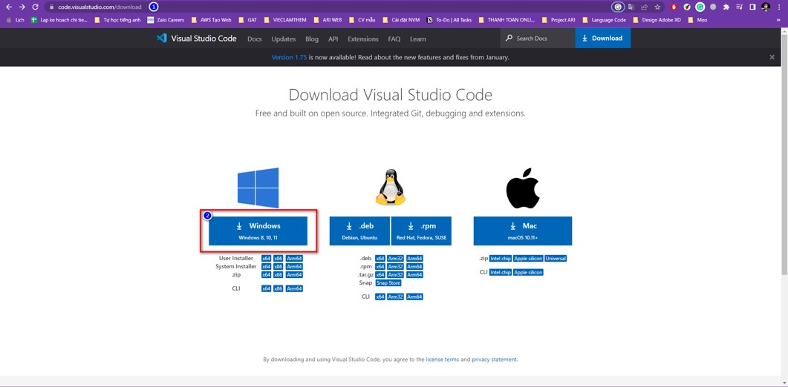

  </div>

### Hệ điều hành Windows

- Tải file cài đặt Visual Studio Code cho Windows.
- Sau khi tải xong, chạy file VSCodeUserSetup.exe.
- Nhấp vào Next để cài đặt. Tiếp theo đồng ý điều khoản sử dụng.
- Lựa chọn nơi cài đặt (Nên để mặc định) sau đó nhấn Next.
- Các bước tiếp theo tiếp tục nhấn Next cho tới khi hoàn tất. Trong quá trình này, nên tích chọn vào 2 chức năng: (1) Add “Open with Code” action to Windows Explorer file context menu và (2) Add “Open with Code” action to Windows Explorer directory context menu. Việc này giúp bạn có thể click chuột phải vào thư mục sẽ có lựa chọn mở bằng VS Code.

### Hệ điều hành MacOS

- Tải file cài đặt Visual Studio Code cho MacOS là 1 file nén zip.
- Sau khi tải xong, tiến hành giải nén bằng cách double click. Khi đó, hãy kéo Visual Studio Code.app vào thư mục Applications.
## Cài đặt phần mềm quản lý mã nguồn
Vào trang web tải [GIT](https://git-scm.com/downloads)  chọn mục Downloads > Chọn Tải xuống Git phiên bản Windows > Mở file Git chọn Run > Chọn Next > Chọn Browse, chọn nơi cài đặt ấn Next > Chọn Next > Chọn vị trí lưu trên Start Menu, lần lượt chọn Next > Chọn Install > Nhấn Finish.
## Chạy thử phần mềm

- Clone mã nguồn từ GITHUB thông qua git
- Mở mã nguồn bằng Visual Studio Code
- Run:
  
    ```sh
      cd suppermarket
      npm i
      npm run start:w
    ```

----

## Cài đặt một số phần mềm cần thiết khác

>>> Làm theo hướng dẫn của trang chủ

<details>
  <summary>Danh sách các phần mềm</summary>
  <ol>
    <li>
      <a href="#github-desktop">Github desktop
</a>
    </li>
    <li>
      <a href="#git">Git
</a>
    </li>
    <li><a href="#dbeaver">DBeaver
</a></li>
  </ol>
</details>

<div style="display: block; width : 100%; margin:20px auto">

  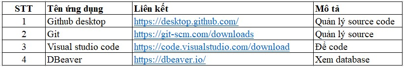

  </div>

## Github desktop :

<div style="display: block; width : 100%; margin:20px auto">

  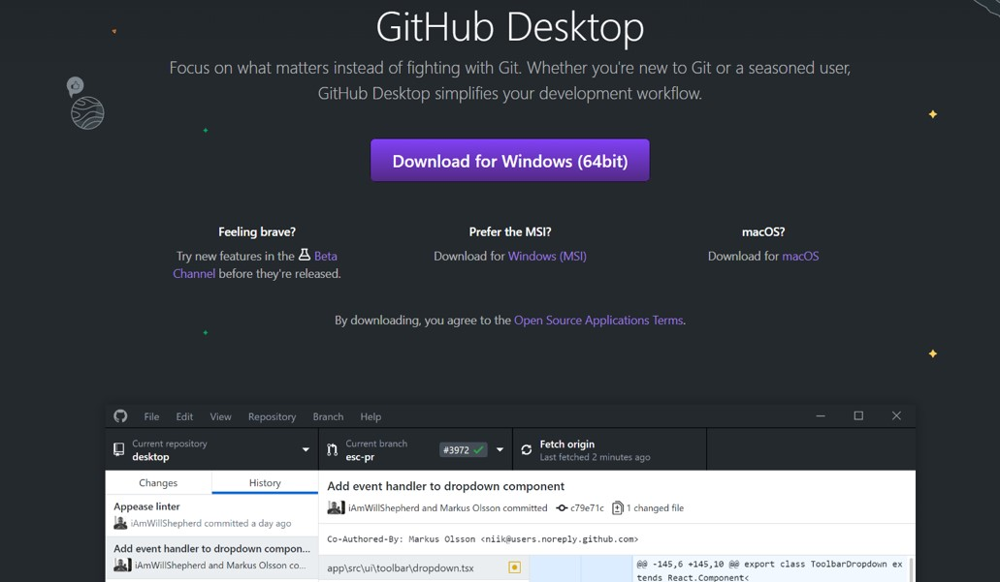

  </div>

## Git :

<div style="display: block; width : 100%; margin:20px auto">

  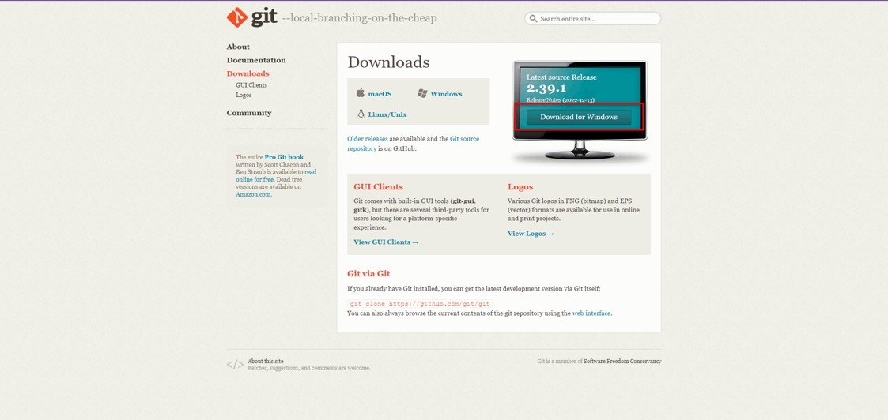

  </div>

## DBeaver :

<div style="display: block; width : 100%; margin:20px auto">

  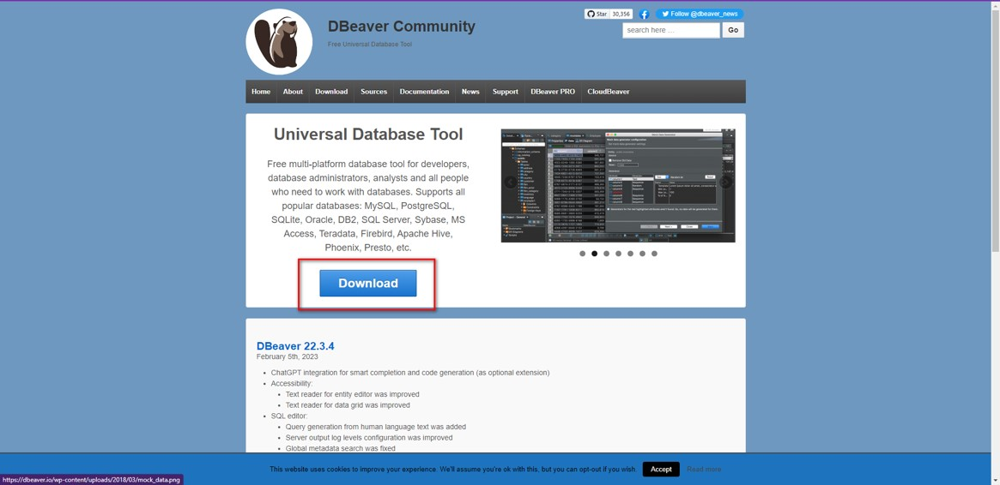

  </div>


----
<br/>

## Cài đặt môi trường dự án và quản lý Source Code bằng Github Desktop

<br/>

- Hướng dẫn cài đặt project

Trước tiên, leader cấp quyền access vào source FE của dự án (gitHub)
Link github Source FE: https://github.com/Ari-balance/balance-fe

Clone source qua SSH hoặc https hoặc github desktop :

<div style="display: block; width : 100%; margin:20px auto">

  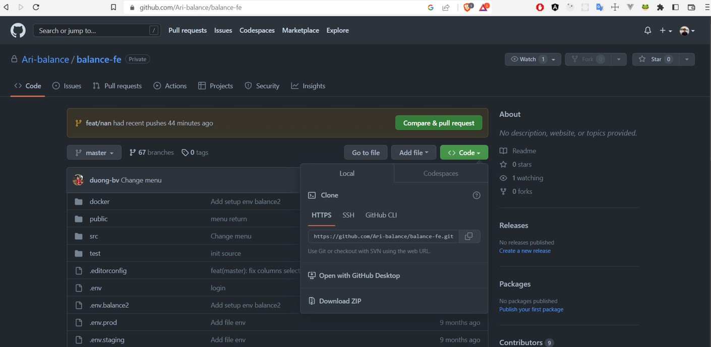

  </div>

Hoặc clone source bằng Github desktop.

- Một số thao tác quản lý source cơ bản với Github desktop (chi tiết xem trang chủ Github desktop)

_ Login xác thực và thao tác quản lý trên Github desktop theo hướng dẫn từ trang chủ Github desktop hoặc https://viblo.asia/p/github-desktop-easy-git-XqaGEQYxGWK

Sau khi access source và login github desktop, chuyển đổi checkout giữa các nhánh ở Current branch


<div style="display: block; width : 100%; margin:20px auto">

  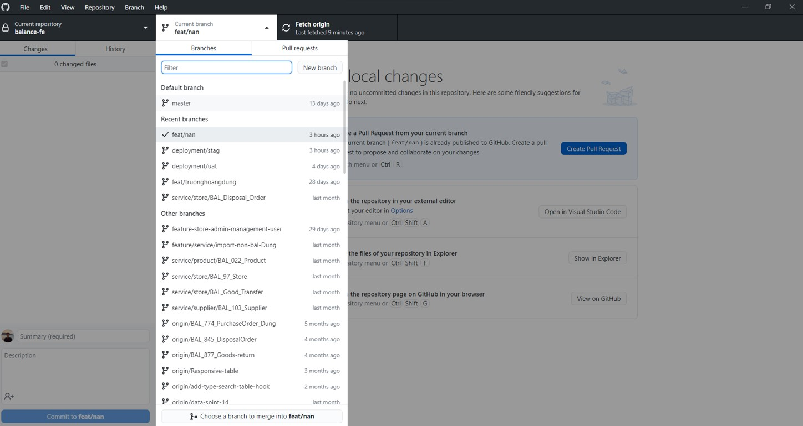

</div>

- Để tạo một nhánh mới copy từ một nhánh khác, chọn nhánh cần copy và chọn "New branch"

<div style="display: block; width : 100%; margin:20px auto">

  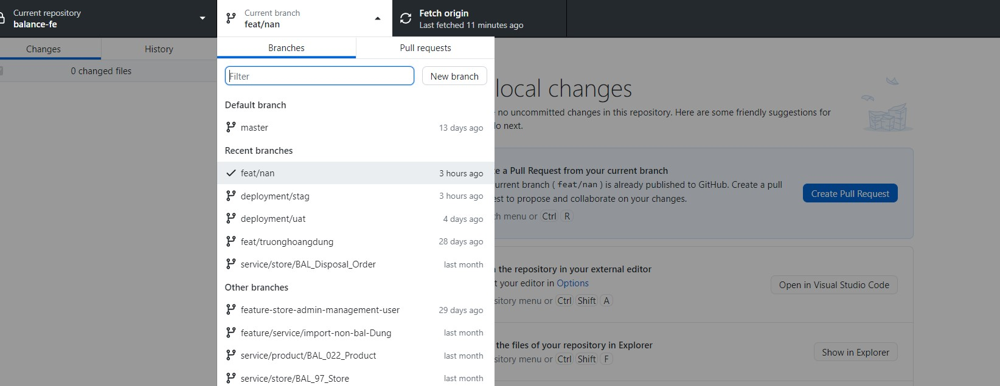

</div>

<div style="display: block; width : 100%; margin:20px auto">

  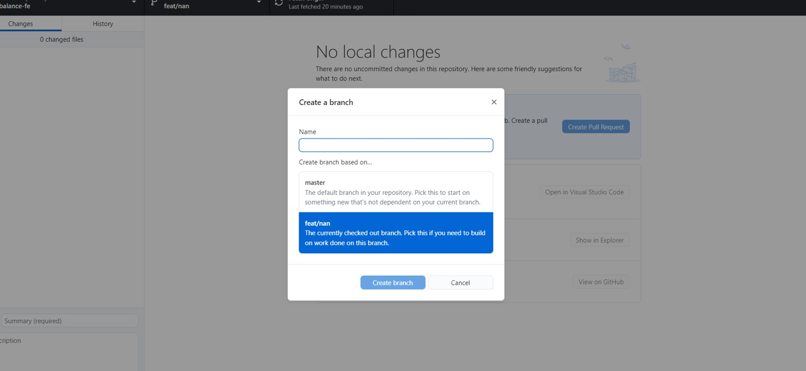

</div>

- Để commit lên nhánh

<div style="display: block; width : 100%; margin:20px auto">

  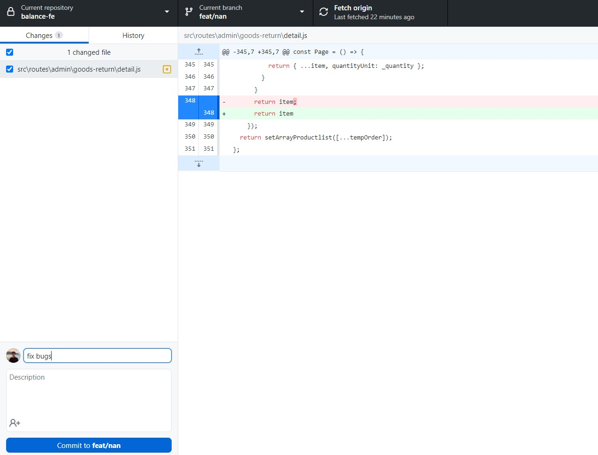

</div>

- Để discard change hay stash change, chuột phải vào file muốn thao tác

<div style="display: block; width : 100%; margin:20px auto">

  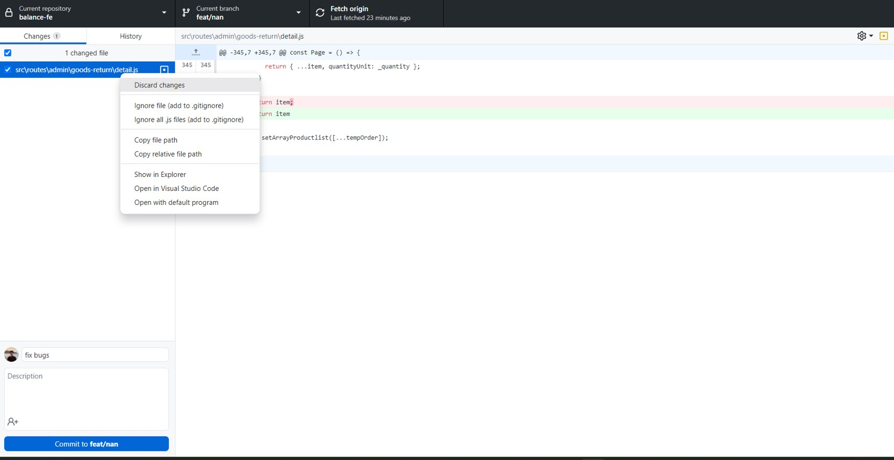

</div>

- Để fetch origin hay pull/push source, thao tác tương ứng ở phần ô lệnh thứ ba

<div style="display: block; width : 50%; margin:20px auto">

  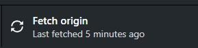

</div>

- Để xem lịch sử commit source, chọn tab History ở phần bên trái màn hình

<div style="display: block; width : 100%; margin:20px auto">

  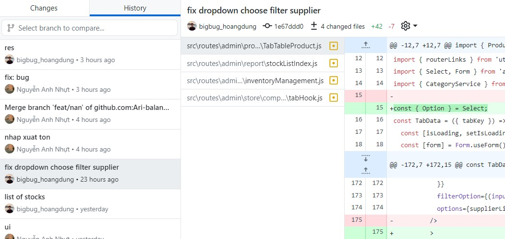

</div>

----

## Khởi chạy Project

Sau khi thực hiện clone source về Visual Code, mở terminal và thực hiện lệnh

 ```sh
  npm install
  ```
 
 để cài đặt các package cần thiết của project.

Khởi chạy source bằng câu lệnh 

 ```sh
  npm run start:w
  ```

 và chạy cổng http://localhost:3335/ trên trình duyệt web.
